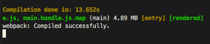

# Webpack Compile Time Plugin

A really simple plugin, with only one purpose. Show the compilation time in the console.

## Options

There is no options yet.

## Usage

```javascript
const CompileTimePlugin = require('webpack-compile-time-plugin');
 
plugins: [
  // ...
  new CompileTimePlugin()
]
```

## Screenshot

